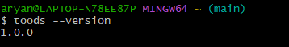
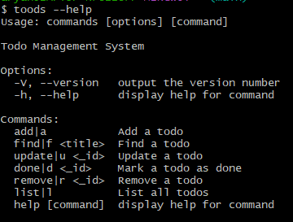
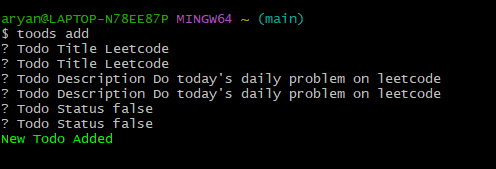
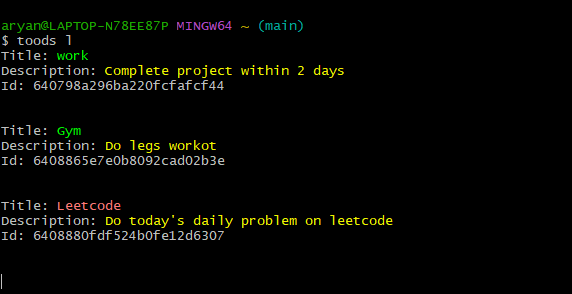
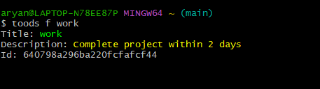

### Todo (CLI version)

This is a command line version of todo list. It performs all the basic commands like add, update, mark done and delete a todo task. You can also view all the tasks and mark them done.

#

### Installation

    still need to figure this out

#

### Usage

* Version

        `toods --version`
    This command will show the version of the app.
    
    

* Help

        `toods help`
    This command will show all the commands and their usage.

    

* Add task 
    
        `toods add` or `toods a`
    After writing this in the command line you will be asked the title, description and the status of the task.

    

* Update task
    
        `toods update <task_id>` or `toods u <task_id>`
    After writing this in the command line you will be asked the updated title, description and the status of the task.

* Mark task done
    
        `toods done <task_id>` or `toods d <task_id>`
    This command will mark the task as done.

* List all tasks
    
        `toods list` or `toods l`
    This command will list all the tasks.
    
    

* Delete task
    
        `toods remove <task_id>` or `toods d <task_id>`
    This command will delete the task with the given id.

* Find task
    
        `toods find <task_title>` or `toods f <task_title>`
    This command will find all the task having the title equivalent to the title you have entered.
    
    

#

### Tech Stack

    Node.js
    Inquirer.js
    MongoDB
    Mongoose 
    Commander.js
    Colors.js
